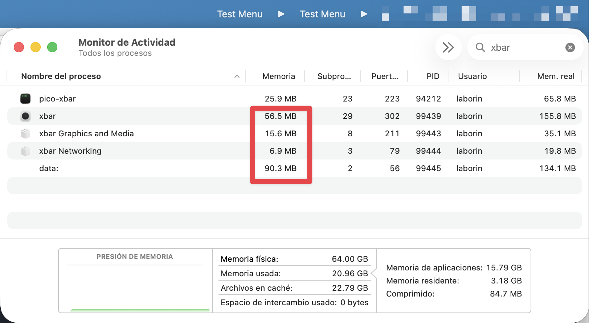

# pico-xbar

A lightweight fork of [xbar](https://github.com/matryer/xbar) that uses native macOS NSStatusBar APIs.

## Features

- 100% compatibility with existing xbar plugins
- Native macOS menu bar integration via custom CGO/NSStatusBar
- No Wails/WebView (no plugin browser)
- Minimal memory footprint: ~20MB vs 120MB+

## Motivation

I've been an xbar user myself for years. I found myself a few days ago wanting to use xbar just to show a minimal visual indicator to know whether if my keyboard function keys are enabled or not, as I toggle them frequently when working on the terminal. A simple command line output tells me the info so xbar was the perfect tool for this. However, I noticed that xbar used a lot of memory and many processes for such a small app that has no UI most of the time. Checking macos activity monitor, I realised that xbar loads a webview in memory even if you never use the plugin browser.

I decided to fork, surgically remove Wails and replace it with systray. I wish I was able to say it was easy, as most of the heavy things for plugin parsing were already done by the original author, but it was not trivial. Wails was not a 'thing' in xbar, but xbar was built on top of Wails. Also, systray did not support multiple menus, and I also tried menuet but it had glitches so I ended up coding a custom implementation using native NSStatusBar.


*Comparison of memory and processes used by xbar and pico-xbar, running side by side*

## Differences from xbar

### Code changes

**Removed:** Wails framework, Svelte WebView frontend, remote services (plugin browser, update checker), and website/tools code.

**Kept unchanged:** The entire `pkg/plugins/` directory wich handles plugin discovery, execution, output parsing and click actions.

**New:** Custom CGO/Objective-C wrapper for NSStatusBar (`internal/statusbar/`), menu builder (`internal/menu/`), and app logic (`internal/app/`).

### Behavioral changes

Menus are updated in-place with a simple diffing mechanism. Renaming a plugin to change its frequency affects it in real-time. Other filename changes or plugin deletion unloads the plugin instead of showing a warning.

### New plugin parameters

- `shrinkImage` - When `true`, resizes images to 16x16, useful if you want to show well aligned icons. Default is `false` (original size, same as xbar).

## Writing Plugins

The xbar documentation for writing plugins applies to pico-xbar: [https://xbarapp.com/docs/plugins/](https://xbarapp.com/docs/plugins/)

## Build from source

```bash
go build -o pico-xbar ./cmd/pico-xbar
```

## Run

```bash
./pico-xbar
```

## Plugin Directory

Plugins are loaded from the standard xbar plugins directory:
```
~/Library/Application Support/xbar/plugins/
```

You can even run xbar and pico-xbar side by side to compare and confirm that your plugins work as expected.

## License

MIT License - see LICENSE.txt

Forked from [xbar](https://github.com/matryer/xbar) by Mat Ryer.

